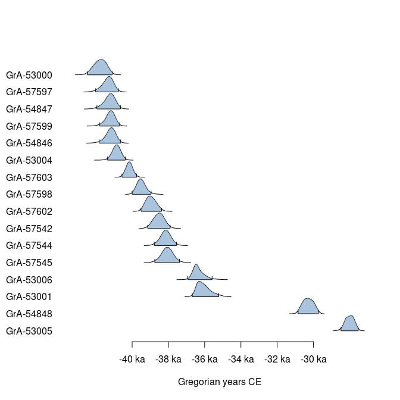

<!-- README.md is generated from README.Rmd. Please edit that file -->

# ananke

<!-- badges: start -->

[](https://github.com/tesselle/ananke/actions)
[](https://app.codecov.io/gh/tesselle/ananke)
[](https://www.codefactor.io/repository/github/tesselle/ananke/overview/main)

<a href="https://tesselle.r-universe.dev/ananke"
class="pkgdown-devel"></a>

[](https://www.repostatus.org/#wip)

[](https://doi.org/10.5281/zenodo.13236285)
<!-- badges: end -->

## Overview

**ananke** provides functions for simple radiocarbon calibration and
chronological analysis.

This package is currently *experimental*. This means that it is
functional, but interfaces and functionalities may change over time,
testing and documentation may be lacking.

------------------------------------------------------------------------

To cite ananke in publications use:

Frerebeau N (2024). *ananke: Quantitative Chronology in Archaeology*.
Université Bordeaux Montaigne, Pessac, France.
<doi:10.5281/zenodo.13236285> <https://doi.org/10.5281/zenodo.13236285>,
R package version 0.0.1.9000, <https://packages.tesselle.org/ananke/>.

This package is a part of the tesselle project
<https://www.tesselle.org>.

## Installation

You can install the released version of **ananke** from
[CRAN](https://CRAN.R-project.org) with:

``` r
install.packages("ananke")
```

And the development version from [GitHub](https://github.com/) with:

``` r
# install.packages("remotes")
remotes::install_github("tesselle/ananke")
```

## Usage

``` r
## Load packages
library(ananke)
```

**ananke** uses [**aion**](https://packages.tesselle.org/aion/) for
internal date representation. Look at
`vignette("aion", package = "aion")` before you start.

``` r
## Data from Bosch et al. 2015
data("ksarakil")

## Calibrate multiple ages
cal <- c14_calibrate(
  values = ksarakil$date,
  errors = ksarakil$error,
  names = ksarakil$code,
  curves = "marine13",
  reservoir_offsets = 53,
  reservoir_errors = 43,
  from = 50000, to = 0
)

## Plot
plot(cal)
```

<!-- -->

``` r

## Full text description
describe(cal, fill = TRUE)
#> Sample GrA-53005 is dated to 26157 +/- 137 BP, calibrated to [-28476,-27542] CE 
#> (95.4% HPD interval) with marine13 (marine reservoir offset: 53 +/- 43; Reimer e
#> t al. 2013).
#> 
#> 
#> Sample GrA-54848 is dated to 28757 +/- 137 BP, calibrated to [-30839,-29739] CE 
#> (95.4% HPD interval) with marine13 (marine reservoir offset: 53 +/- 43; Reimer e
#> t al. 2013).
#> 
#> 
#> Sample GrA-53006 is dated to 34257 +/- 234 BP, calibrated to [-36922,-35609] CE 
#> (95.4% HPD interval) with marine13 (marine reservoir offset: 53 +/- 43; Reimer e
#> t al. 2013).
#> 
#> 
#> Sample GrA-57545 is dated to 35827 +/- 264 BP, calibrated to [-38740,-37393] CE 
#> (95.4% HPD interval) with marine13 (marine reservoir offset: 53 +/- 43; Reimer e
#> t al. 2013).
#> 
#> 
#> Sample GrA-54847 is dated to 39857 +/- 372 BP, calibrated to [-41933,-40649] CE 
#> (95.4% HPD interval) with marine13 (marine reservoir offset: 53 +/- 43; Reimer e
#> t al. 2013).
#> 
#> 
#> Sample GrA-57544 is dated to 35907 +/- 234 BP, calibrated to [-38768,-37556] CE 
#> (95.4% HPD interval) with marine13 (marine reservoir offset: 53 +/- 43; Reimer e
#> t al. 2013).
#> 
#> 
#> Sample GrA-57598 is dated to 37267 +/- 273 BP, calibrated to [-39990,-38963] CE 
#> (95.4% HPD interval) with marine13 (marine reservoir offset: 53 +/- 43; Reimer e
#> t al. 2013).
#> 
#> 
#> Sample GrA-57599 is dated to 39837 +/- 313 BP, calibrated to [-41790,-40694] CE 
#> (95.4% HPD interval) with marine13 (marine reservoir offset: 53 +/- 43; Reimer e
#> t al. 2013).
#> 
#> 
#> Sample GrA-53001 is dated to 34037 +/- 224 BP, calibrated to [-36675,-35233] CE 
#> (95.4% HPD interval) with marine13 (marine reservoir offset: 53 +/- 43; Reimer e
#> t al. 2013).
#> 
#> 
#> Sample GrA-54846 is dated to 39797 +/- 343 BP, calibrated to [-41810,-40639] CE 
#> (95.4% HPD interval) with marine13 (marine reservoir offset: 53 +/- 43; Reimer e
#> t al. 2013).
#> 
#> 
#> Sample GrA-57602 is dated to 36677 +/- 244 BP, calibrated to [-39505,-38379] CE 
#> (95.4% HPD interval) with marine13 (marine reservoir offset: 53 +/- 43; Reimer e
#> t al. 2013).
#> 
#> 
#> Sample GrA-57603 is dated to 38207 +/- 264 BP, calibrated to [-40554,-39758] CE 
#> (95.4% HPD interval) with marine13 (marine reservoir offset: 53 +/- 43; Reimer e
#> t al. 2013).
#> 
#> 
#> Sample GrA-57542 is dated to 36237 +/- 244 BP, calibrated to [-39133,-37913] CE 
#> (95.4% HPD interval) with marine13 (marine reservoir offset: 53 +/- 43; Reimer e
#> t al. 2013).
#> 
#> 
#> Sample GrA-53004 is dated to 39337 +/- 333 BP, calibrated to [-41350,-40380] CE 
#> (95.4% HPD interval) with marine13 (marine reservoir offset: 53 +/- 43; Reimer e
#> t al. 2013).
#> 
#> 
#> Sample GrA-57597 is dated to 39987 +/- 343 BP, calibrated to [-42004,-40765] CE 
#> (95.4% HPD interval) with marine13 (marine reservoir offset: 53 +/- 43; Reimer e
#> t al. 2013).
#> 
#> 
#> Sample GrA-53000 is dated to 40497 +/- 353 BP, calibrated to [-42453,-41109] CE 
#> (95.4% HPD interval) with marine13 (marine reservoir offset: 53 +/- 43; Reimer e
#> t al. 2013).
#> 
#> 
#> Calibration was computed with R 4.4.1 (R Core Team 2024) and package ananke 0.0.1 (Frerebeau 2024).
```

## Related Works

- [**Bchron**](https://github.com/andrewcparnell/Bchron) enables quick
  calibration of radiocarbon dates, age-depth modelling, relative sea
  level rate estimation, and non-parametric phase modelling.
- [**racarbon**](https://github.com/ahb108/rcarbon) includes functions
  not only for basic calibration, uncalibration, and plotting of one or
  more dates, but also a statistical framework for building demographic
  and related longitudinal inferences from aggregate radiocarbon date
  lists.
- [**rintcal**](https://github.com/Maarten14C/rintcal) consists of a
  data compilation of the IntCal radiocarbon calibration curves and
  provides a number of functions to assist with calibrating dates and
  plotting calibration curves.

## Contributing

Please note that the **ananke** project is released with a [Contributor
Code of Conduct](https://www.tesselle.org/conduct.html). By contributing
to this project, you agree to abide by its terms.
