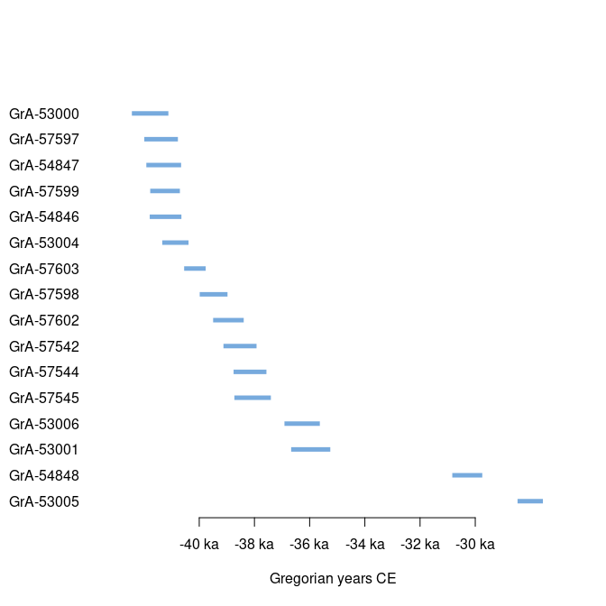

<!-- README.md is generated from README.Rmd. Please edit that file -->

# ananke

<!-- badges: start -->

[](https://github.com/tesselle/ananke/actions)
[](https://app.codecov.io/gh/tesselle/ananke)
[](https://www.codefactor.io/repository/github/tesselle/ananke/overview/main)
[](https://cran.r-project.org/package=ananke)

<a href="https://tesselle.r-universe.dev" class="pkgdown-devel"></a>

[](https://www.repostatus.org/#wip)
<!-- badges: end -->

## Overview

**ananke** provides functions for radiocarbon calibration and
chronological analysis.

## Installation

You can install the released version of **ananke** from
[CRAN](https://CRAN.R-project.org) with:

``` r
install.packages("ananke")
```

And the development version from [GitHub](https://github.com/) with:

``` r
# install.packages("remotes")
remotes::install_github("tesselle/ananke")
```

## Usage

``` r
## Load packages
library(ananke)
```

``` r
## Data from Bosch et al. 2015
data("ksarakil")

## Calibrate multiple dates
cal <- c14_calibrate(
  ages = ksarakil$date,
  errors = ksarakil$error,
  names = ksarakil$code,
  curves = "marine13",
  reservoir_offsets = 53,
  reservoir_errors = 43,
  from = 50000, to = 0
)

## Plot
plot(cal)
```

<!-- -->

``` r
plot(cal, density = FALSE, level = 0.95, lwd = 5)
```

<!-- -->

## Contributing

Please note that the **ananke** project is released with a [Contributor
Code of Conduct](https://www.tesselle.org/conduct.html). By contributing
to this project, you agree to abide by its terms.
