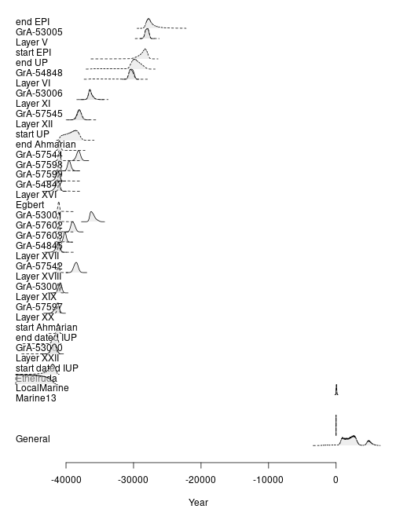

These examples use data available through the [**fasti**](https://packages.tesselle.org/fasti/) package which is available in a [separate repository](https://tesselle.r-universe.dev). **fasti** provides OxCal [@bronkramsey2009] input models.


```r
## Install the latest version
install.packages("fasti", repos = "https://tesselle.r-universe.dev")
```


```r
## Load package
library(ananke)

## Download OxCal
oxcal_setup()
```


```r
## Read OxCal script from Bosch et al. 2015
path <- system.file("oxcal/ksarakil/ksarakil.oxcal", package = "fasti")
scr <- readLines(path)

## Print script
# cat(scr, sep = "\n")

## Execute OxCal script
## /!\ this may take a while /!\
out <- oxcal_execute(scr)

## Parse OxCal output
res <- oxcal_parse(out)
```


```r
plot(res)
```



## References
